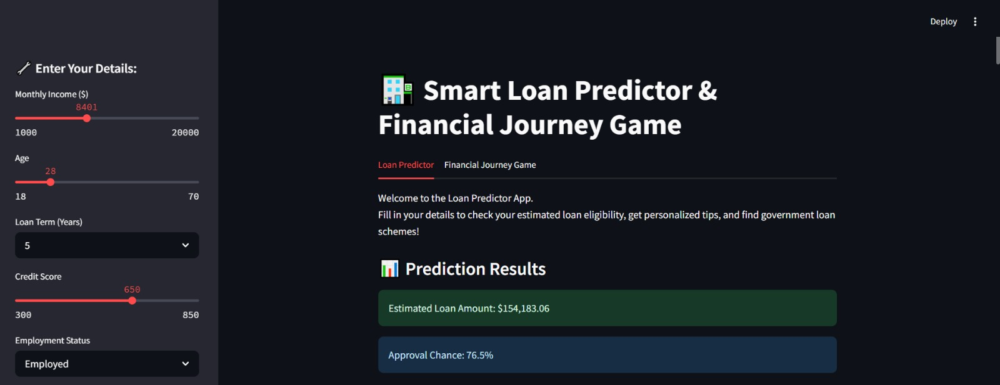
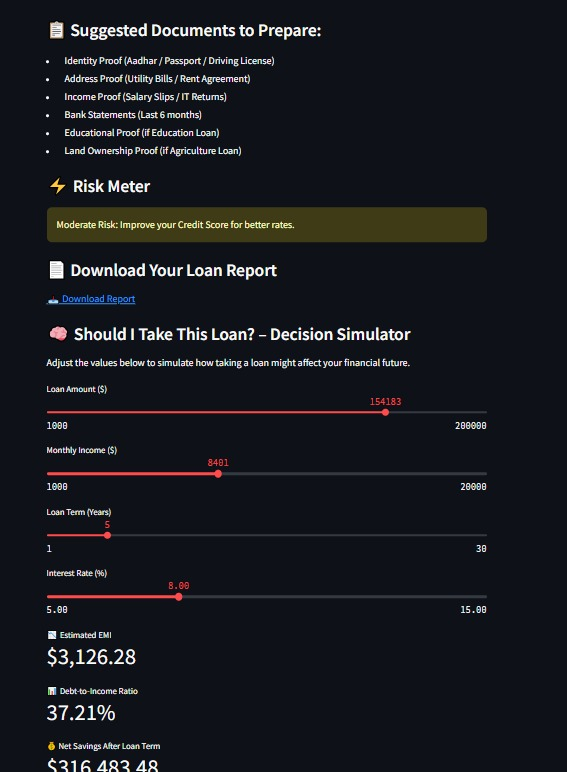
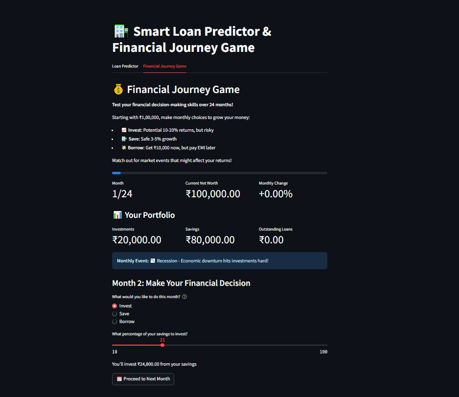
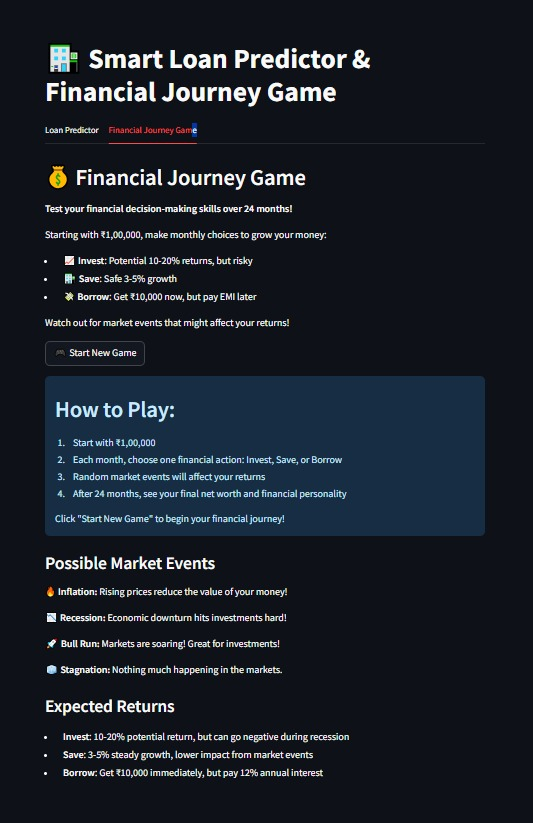
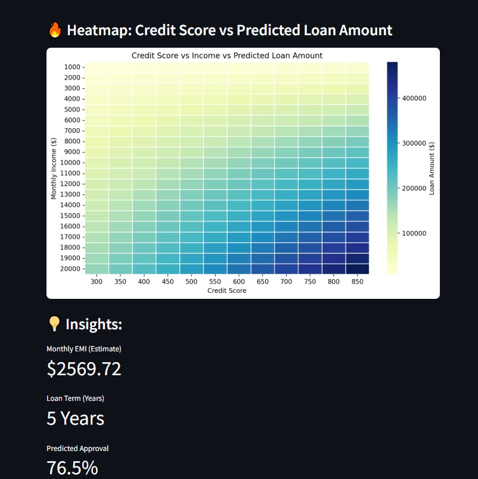
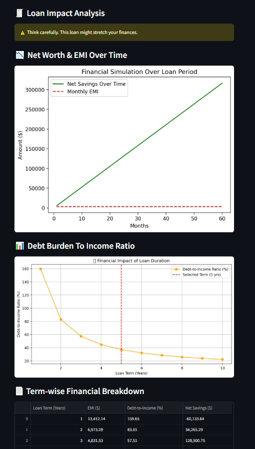
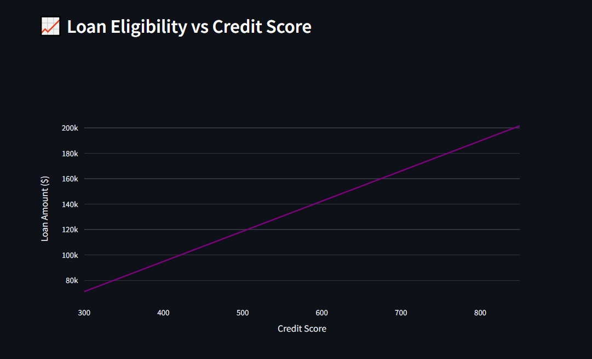

# 🏦 **Smart Loan Predictor & Financial Journey Game**

A **Streamlit-based web app** that combines two powerful financial tools:

- 🔮 **Loan Prediction System** – Get insights into your loan eligibility, EMI, and recommended government schemes.
- 🎮 **Financial Journey Simulation Game** – Make monthly money decisions and track your financial growth over 24 months!

---

## 📸 Screenshots

### 📊 Dashboard


### 🧠 Decision Simulator


### 🎮 Financial Journey Game


### 📝 Game Instructions


### 🔥 HeatMap


### 💸 Loan Impact Analysis


### 📈 Loan vs Credit



## ✨ **Key Features**

### 📊 **Loan Predictor**
- **Estimate your loan eligibility** based on:
  - **Income, Age, Credit Score, Employment Status, Loan Type, Occupation**
- **Visualizations:**
  - 📈 Loan Amount vs Credit Score (Interactive)
  - 🔥 Heatmap: Credit Score vs Income
- **Insights:**
  - 💰 Estimated EMI
  - ⚖️ Approval Probability
  - 🧾 Downloadable Loan Report
- 🧞‍♂️ **Loan Genie:** Get **custom-suggested government schemes** based on your profile
- ⚠️ **Risk Meter:** Understand your credit health
- 🧠 **Decision Simulator:** Simulate how loans affect your savings and debt-to-income ratio over time

---

### 💰 **Financial Journey Game**
- **Start with ₹1,00,000** and play for **24 months**
- Choose your monthly action:
  - 📈 **Invest**: High return, higher risk
  - 🏦 **Save**: Safe with modest returns
  - 💸 **Borrow**: Immediate cash but pay EMI later
- React to **market events** (Recession, Inflation, Bull Run...)
- 🎯 At the end, discover your:
  - **Final Net Worth**
  - **Financial Personality**
  - **Risk Score**
  - 📊 Full Financial Summary

---

## 🛠️ **Tech Stack**

| Tool          | Purpose                     |
|---------------|-----------------------------|
| 🐍 Python     | Core logic                  |
| 🌐 Streamlit  | Web app frontend            |
| 📊 Matplotlib | Data visualization          |
| 📈 Plotly     | Interactive charts          |
| 🧮 Numpy/Pandas | Data computation & handling |
| 🎨 Seaborn    | Heatmaps                    |

---

## 💻 **Setup Instructions**

```bash
# Clone the repo
git clone https://github.com/nikkiii2807/CF_Project_new.git


# Run the app
streamlit run loan.py
